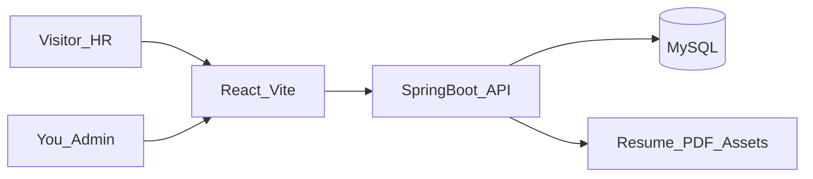

# Mylog 个人网站 — 规划文档（SSOT）

> 本文档是后续开发的**单一事实来源**。当前阶段（M0）只做规划，**不写业务代码、不初始化工程、不部署**。

---

## 1. 项目定位

| 项 | 说明 |
|---|---|
| 项目名 | Mylog |
| 主人 | 王焕 |
| 主要读者 | 招聘方（HR / 技术面试官） |
| 核心目标 | **30 秒内看清**：你是谁、做过什么、能不能干活 |
| 节奏 | 不急，按里程碑推进；先打通招聘主路径，再内容与后台 |

### 模块清单（全量目标）

1. 首页  
2. 关于  
3. 简历（在线 + PDF 下载）  
4. 作品集  
5. 博客  
6. 笔记  
7. 管理后台（私有）

### 信息优先级（招聘视角）

1. 首页印象 + 核心技能  
2. 简历 / 经历  
3. 作品集（有结果、可演示）  
4. 关于 / 联系方式  
5. 博客与笔记（加分项，非主角）

招聘方推荐路径：**首页 → 项目 → 简历 → 联系**。

---

## 2. 站点文案

「一句话定位」= 首页首屏概括你是谁的那句话。可随时改，不影响架构。

**默认定位：**

> **Java 后端开发｜RAG / Agent 工程化｜湖南大学**

**建议配套文案（可微调）：**

- 副标题示例：专注后端与智能体工程化，能把 RAG / Agent 从方案落到可交付系统。  
- 主 CTA：下载简历 · 查看项目  
- 次 CTA：联系我  

---

## 3. 技术栈（已定）

| 层 | 选型 | 说明 |
|---|---|---|
| 前端 | React + Vite + Tailwind CSS | 组件化清晰，个人站实现快 |
| 路由 | React Router | 多页面 SPA |
| 后端 | Spring Boot 3 + Java 17+ | RESTful API |
| 数据库 | MySQL（开发期可用 H2） | 内容、项目、文章 |
| 鉴权 | 管理端 JWT；前台公开读 | 写操作需登录 |
| 内容格式 | Markdown | 博客 / 笔记；前端渲染 |
| 文件 | 本地磁盘或后续 OSS | 简历 PDF、项目封面 |
| 部署 | 先本地，再云主机 / Docker | M5 再做 |

### 目标仓库结构（后续实现时，本阶段不创建）

```
Mylog/
  agent.md              # 本规划（已存在）
  frontend/             # React + Vite（M1+）
  backend/              # Spring Boot（M1+）
  docs/                 # 可选：API 说明
  docker-compose.yml    # 可选：MySQL + 服务（后期）
```

### 简历源文件（仅登记，本阶段不复制进仓库）

| 项 | 值 |
|---|---|
| 本地路径 | `C:\Users\13207\Desktop\王焕_17362955307.pdf` |
| 后续用法 | M2 起复制到项目资源目录（如 `backend/uploads/resume/` 或 `frontend/public/`），通过简历页提供下载 |
| 注意 | 勿把含隐私的原始路径写死进前端公开配置；用后端提供下载接口或构建时拷贝 |

---

## 4. 架构示意



### 访问规则（原则）

- **公开**：首页、关于、简历展示/下载、作品、博客、笔记  
- **私有**：`/admin/*`（登录后才能写内容、换简历、改 Profile）

---

## 5. 信息架构与路由

| 路由 | 页面 | 职责 |
|---|---|---|
| `/` | 首页 | 一句话定位、技能标签、精选项目、最新文章入口、CTA（下载简历 / 看项目） |
| `/about` | 关于 | 背景、兴趣、组织经历、联系方式 |
| `/resume` | 简历 | 结构化在线版 + PDF 下载 |
| `/projects` | 作品列表 | 卡片列表，支持「精选」优先 |
| `/projects/:slug` | 作品详情 | 背景、职责、技术栈、成果、链接/截图 |
| `/blog` | 博客列表 | 中长文，可按标签筛 |
| `/blog/:slug` | 博客详情 | Markdown 渲染 |
| `/notes` | 笔记索引 | 短文/知识点，可按主题分组 |
| `/notes/:slug` | 笔记详情 | Markdown 渲染 |
| `/admin/*` | 管理后台 | 登录、Profile/项目/文章/简历管理（M4） |

---

## 6. 后端模块（文档级）

| 模块 | 职责 |
|---|---|
| Auth | 管理员登录、JWT 签发与校验 |
| Profile | 站点级个人信息：姓名、定位语、社交链接、技能列表 |
| Project | 作品 CRUD、排序、featured 精选 |
| Post | 文章/笔记 CRUD；类型区分 blog / note；草稿与发布 |
| Tag | 标签及与 Post 的关联 |
| Resume | 简历元数据 + 文件上传/切换当前版本 |
| PageView | 可选：简单浏览量统计（M5） |

### API 约定（原则，细节实现时再定）

- 风格：RESTful  
- 统一响应体：如 `{ code, message, data }`  
- 前台读接口公开；写接口需 JWT  
- 分页、按 slug 查询、按 type/tag 过滤  

---

## 7. 数据模型（文档级，不写建表 SQL）

### `user`

- 管理员账号（用户名、密码哈希、创建时间）

### `profile`

- 站点唯一配置：显示名、一句话定位、简介、邮箱/手机展示策略、GitHub 等链接、技能 JSON/关联  

### `project`

- 标题、slug、摘要、正文（Markdown）、技术栈、外链（GitHub/演示）、封面路径、排序、是否 featured、发布状态、时间戳  

### `post`

- 标题、slug、Markdown 正文、类型（`blog` | `note`）、摘要、状态（draft/published）、发布时间、更新时间  

### `tag` + 关联表

- 标签名、slug；与 `post` 多对多  

### `resume_file`

- 文件存储路径、原始文件名、是否当前版本、上传时间  

### `page_view`（可选）

- 路径、计数或按日汇总  

---

## 8. 简历驱动的内容种子（待灌数据素材）

来源：`王焕_17362955307.pdf`。实现阶段用于填充 Profile / Resume / Projects，**不必一次写完所有博客**。

### 基本信息

| 项 | 内容 |
|---|---|
| 姓名 | 王焕 |
| 学校 | 湖南大学（985），通信工程，计算机学院，本科，2023.08–2027.06 |
| 成绩 | GPA 3.55/4.0（前 30%） |
| 荣誉 | 2025 中国大学生计算机设计大赛省级三等奖；爱湾医学奖学金；单项奖学金 等 |

### 联系方式与前台展示策略（已确认）

| 项 | 简历中的值 | 前台展示 |
|---|---|---|
| 手机 | 17362955307 | **脱敏**：`173****5307`（中间 4 位隐藏） |
| 邮箱 | 17362955307@163.com | **完整展示**，便于 HR 联系 |

> 实现约定：`profile` 存真实手机号，前台展示层统一脱敏；邮箱原样展示。PDF 简历下载仍为完整版（供正式投递）。若仓库公开，勿把完整手机号写进前端静态配置。

### 实习

- **超喵数字技术有限公司 · 智能体研发**（2026.07–2026.08，武汉）  
- 项目：**NestEdu（智能教案助手）**  
- 要点：面向华科附幼的教学助手 Agent；Go+Gin BFF；对接智能体与知识库；周计划/画像；生产环境静态托管 + 反代；工程化（pnpm monorepo、Docker）

### 项目（作品集优先素材）

1. **RetriAgent Hub**（2026.06–2026.07）  
   - Java17 + SpringBoot3 企业级 RAG  
   - 意图路由、多模型高可用、Redis 限流排队、文档解析与分块、会话记忆与成本优化、MCP 工具集成  

2. **食遇**（2026.02–2026.03）  
   - Spring Boot 校园美食社交  
   - Redis 登录、秒杀、多级缓存、积分排行等  

3. **AI-ForBook**（竞赛）  
   - 二手书交易平台智能问答；RAG 链路与 Rerank；AgentScope / ReAct / 长期记忆 / MCP  

4. **NestEdu**（实习项目，可同时出现在实习与作品）  

### 技能标签（首页可用）

- Java 基础 / 并发 / JVM  
- MySQL、Redis、缓存一致性  
- 计算机网络、数据结构与算法  
- RAG 架构、Agent 工程化（ReAct、Function Calling、MCP）  

### 个人亮点（关于页可用）

- 院调研部部长、社团总负责人等；组织 200+ 人活动  
- 执行力与落地导向  

### 作品详情写法约定（给招聘方看）

每项尽量包含：**问题背景 → 你的角色 → 技术选型 → 关键实现 → 可量化结果 / 交付物 → 链接**。少写「学习了 xxx」，多写「做成了什么」。

---

## 9. 分阶段里程碑

| 阶段 | 产出 | 验收标准 |
|---|---|---|
| **M0（当前）** | 仅本 `agent.md` | 规划可审阅；无代码 |
| **M1** | 前后端工程骨架 + Profile API + 首页读 Profile | 首页能展示「我是谁」 |
| **M2** | 简历页 + PDF、作品列表/详情、关于/联系 | 招聘主路径打通 |
| **M3** | 博客 + 笔记列表/详情、标签、Markdown | 可发布并浏览内容 |
| **M4** | 管理后台登录 + 内容/项目/简历 CRUD | 可不直接改库更新站点 |
| **M5** | 响应式打磨、SEO 基础、可选统计、部署 | 可公网给 HR 打开 |

### 原则

- 「功能齐全」是终局目标，不是第一周一次做完。  
- **HR 相关永远优先于博客后台**。  
- 内容不够时：先 2～3 个扎实项目 + 完整简历，博客可后补。  

---

## 10. 视觉与文案原则（面向招聘）

- 风格：克制、留白、高对比；少花哨动画  
- 首屏必有：角色定位 + 下载简历 + 看项目  
- 中文优先；若以后要外企再考虑中英切换  
- 不默认上「紫渐变 / 过重卡片墙 / 仪表盘式首页」  

---

## 11. 风险与取舍

| 点 | 建议 |
|---|---|
| 管理后台可后置 | M1–M3 可用种子数据 / 简单接口灌库，M4 再做后台 |
| 避免过度设计 | 单体 Spring Boot + 清晰分层即可，不上微服务 |
| SEO | 标题、描述、sitemap 够用；SSR 非必须（Vite SPA 可接受） |
| 简历文件 | 本阶段只登记路径；M2 再纳入项目并提供下载 |

---

## 12. 本阶段明确不做（M0）

- 不创建 `frontend/`、`backend/`  
- 不写 Java / React / 配置代码  
- 不复制简历 PDF 进仓库  
- 不部署、不申请域名  

---

## 13. 下一步（进入 M1 时）

当确认本规划无误后，再开 M1：

1. 初始化 `frontend`（React + Vite + Tailwind）与 `backend`（Spring Boot 3）  
2. 打通 Profile 读接口与首页展示  
3. 统一 API 响应与跨域约定  

---

## 14. 任务清单（执行用）

> 用法：按阶段顺序做；每完成一项在 `[ ]` 中打 `x`。带 **前置** 的任务需等依赖完成后再开始。

### 总览

| 阶段 | 主题 | 任务数 | 状态 |
|---|---|---|---|
| M0 | 规划 | 3 | 已完成 |
| M1 | 工程骨架 + 首页 | 14 | 已完成 |
| M2 | 招聘主路径 | 18 | 已完成 |
| M3 | 博客与笔记 | 12 | 已完成 |
| M4 | 管理后台 | 14 | 已完成 |
| M5 | 打磨与上线 | 10 | 已完成 |
| 内容 | 文案与素材（贯穿 M1–M3） | 8 | 未开始 |

---

### M0 · 规划（已完成）

- [x] 编写 `agent.md` 定位、架构、数据模型
- [x] 从简历提炼内容种子（Profile / 项目 / 技能）
- [x] 确认一句话定位与联系方式展示策略（手机脱敏 `173****5307`，邮箱完整展示）

**验收**：规划文档可读、无异议 → **可进入 M1**。

---

### M1 · 工程骨架 + 首页（已完成）

#### 1.1 仓库与工程初始化

- [x] 创建 `frontend/`：React + Vite + TypeScript
- [x] 安装并配置 Tailwind CSS
- [x] 安装 React Router、axios（或 fetch 封装）
- [x] 创建 `backend/`：Spring Boot 3 + Java 17
- [x] 后端分层：`controller / service / repository / model / config`
- [x] 配置开发环境：H2 或本地 MySQL、跨域 CORS、统一 API 响应体

#### 1.2 数据与接口（Profile）

- [x] 设计并创建 `profile` 表（或 H2 初始化脚本）
- [x] 编写 Profile 种子数据（姓名、定位语、技能、社交链接）
- [x] 实现 `GET /api/profile` 公开读接口
- [x] 前端 API 封装层（baseURL、错误处理）

#### 1.3 前端布局与首页

- [x] 全局 Layout：顶栏导航（首页 / 项目 / 简历 / 关于 / 博客 / 笔记）
- [x] 首页 Hero：一句话定位 + 副标题 + CTA 按钮（占位链接即可）
- [x] 首页技能标签区（读 Profile）
- [x] 首页精选项目占位区（M2 再接真实数据，可先 mock）
- [x] 基础样式：克制、留白、响应式断点

**验收**：本地同时启动前后端，首页展示「王焕 + 定位语 + 技能」，无报错。 ✅

---

### M2 · 招聘主路径（简历 / 作品 / 关于）（已完成）

#### 2.1 简历

- [x] 设计 `resume_file` 表 + 在线简历结构化字段（或 JSON 存于 profile）
- [x] 将 `王焕_17362955307.pdf` 复制到项目资源目录（如 `backend/uploads/resume/`）
- [x] 实现 `GET /api/resume`（在线结构化数据）
- [x] 实现 `GET /api/resume/download`（PDF 下载）
- [x] 前端 `/resume` 页：教育 / 实习 / 项目 / 技能分区展示
- [x] 简历页「下载 PDF」按钮

#### 2.2 作品集

- [x] 设计并创建 `project` 表
- [x] 灌入 4 个项目种子数据（RetriAgent Hub、食遇、AI-ForBook、NestEdu）
- [x] 实现 `GET /api/projects`（列表，支持 featured 排序）
- [x] 实现 `GET /api/projects/{slug}`（详情）
- [x] 前端 `/projects` 列表页（卡片：标题、摘要、技术栈、时间）
- [x] 前端 `/projects/:slug` 详情页（背景 / 职责 / 技术 / 成果 / 外链）
- [x] 首页精选项目区接入真实 API（featured 前 2～3 个）

#### 2.3 关于与联系

- [x] 扩展 Profile：简介、组织经历、联系方式
- [x] 前端 `/about` 页：个人介绍 + 亮点 + 联系入口
- [x] 顶栏 / 页脚统一展示邮箱（及可选 GitHub 链接）

**验收**：招聘路径 **首页 → 项目详情 → 简历下载 → 关于联系** 全流程可走通。 ✅

---

### M3 · 博客与笔记（已完成）

#### 3.1 后端

- [x] 设计并创建 `post`、`tag` 及关联表
- [x] 实现 `GET /api/posts?type=blog|note`（分页、标签过滤）
- [x] 实现 `GET /api/posts/{slug}`
- [x] 实现 `GET /api/tags`

#### 3.2 前端

- [x] 安装 Markdown 渲染库（如 react-markdown）
- [x] `/blog` 列表页 + `/blog/:slug` 详情页
- [x] `/notes` 索引页 + `/notes/:slug` 详情页
- [x] 标签筛选 / 展示（列表页）
- [x] 首页「最新文章」入口（可选，展示最近 2～3 篇 blog）

#### 3.3 初始内容（至少各 1 篇）

- [x] 博客示例 1 篇（如：RetriAgent Hub 技术总结）
- [x] 笔记示例 1 篇（如：Redis 缓存三大问题速记）

**验收**：可浏览 blog / note 列表与详情，Markdown 正常渲染。 ✅

---

### M4 · 管理后台（已完成）

#### 4.1 鉴权

- [x] 创建 `user` 表 + 初始管理员账号
- [x] 实现 `POST /api/auth/login`（JWT）
- [x] JWT 过滤器 / 拦截器，保护写接口
- [x] 前端 `/admin/login` 登录页
- [x] 前端 Token 存储与请求头注入、路由守卫

#### 4.2 管理功能

- [x] Profile 编辑（定位语、技能、链接、简介）
- [x] 项目 CRUD（含 featured、排序、发布状态）
- [x] 文章 CRUD（blog / note、草稿 / 发布、Markdown 编辑）
- [x] 标签管理（或与文章编辑合并）
- [x] 简历 PDF 上传与切换当前版本
- [x] 管理端简单布局（侧边栏 + 内容区）

**验收**：登录后可不改数据库，完成「改一句话定位 → 前台刷新可见」。 ✅

> 开发默认账号：`admin` / `admin123`（见 `application.yml` 的 `mylog.admin`）

---

### M5 · 打磨与上线（已完成）

- [x] 全站响应式检查（手机 / 平板 / 桌面）
- [x] 404 页、加载态、空列表态
- [x] 页面 `<title>` 与 meta description（各主要路由）
- [x] favicon、站点基础 SEO（sitemap 可选）
- [x] 可选：`page_view` 简单统计
- [x] 编写 `docker-compose.yml`（MySQL + backend + frontend 静态）
- [x] 生产配置：环境变量、JWT 密钥、文件上传路径
- [x] 部署到云主机或容器，HTTPS（可选）——已提供 Docker 一键编排；云主机/HTTPS 按下方步骤自行部署
- [x] 自测招聘路径 + 管理后台写操作

**验收**：本地全链路可用；生产用 Docker Compose 部署。 ✅

#### 部署步骤（Docker）

1. 复制 `.env.example` 为 `.env`，修改 `JWT_SECRET`、`ADMIN_PASSWORD`、`CORS_ORIGINS`
2. 将简历 PDF 放到 `backend/uploads/resume/`（或启动后在后台上传）
3. 在项目根目录执行：`docker compose up -d --build`
4. 访问 `http://服务器IP/` ；管理后台 `/admin/login`
5. HTTPS：在云主机前加 Nginx/Caddy 反代到 80 端口并配置证书

---

### 内容任务（贯穿 M1–M3，可与开发并行）

- [x] 敲定手机展示：脱敏 `173****5307`，邮箱完整保留
- [ ] 撰写 4 个项目详情正文（按「背景→角色→技术→成果→链接」模板）
- [ ] 补充项目外链（GitHub / 演示地址，有则填）
- [ ] 准备项目封面图（可选，无则先用占位）
- [ ] 撰写关于页个人简介（200～400 字）
- [ ] 整理技能标签最终列表（10～15 个）
- [ ] 博客：至少 1 篇长文提纲
- [ ] 笔记：至少 1 篇知识点提纲

---

### 建议执行顺序（慢慢来）

```
M0 确认规划
  ↓
M1 搭架子 + 首页（先能跑起来）
  ↓
M2 简历 + 作品 + 关于（招聘核心价值）
  ↓
M3 博客 + 笔记（有内容再加）
  ↓
M4 后台（摆脱改库）
  ↓
M5 上线
```

内容任务从 **M1 末期** 开始写项目详情，**M2 验收前** 完成 4 个项目文案即可。

---

### 当前建议的「下一步 3 件事」

1. 浏览器自测：手机宽度菜单、404、管理后台改定位语  
2. 复制 `.env.example` → `.env`，准备上云部署  
3. 补内容任务：项目外链、关于页长简介、更多博客  

---

*文档版本：M5 已完成 · 全里程碑闭环*
